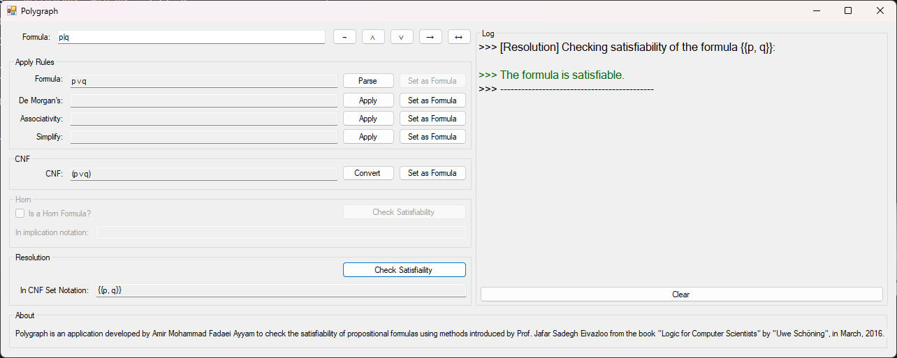
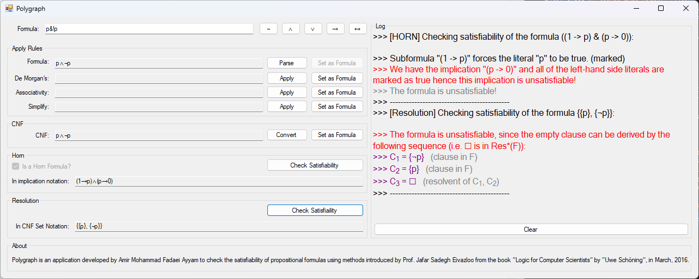
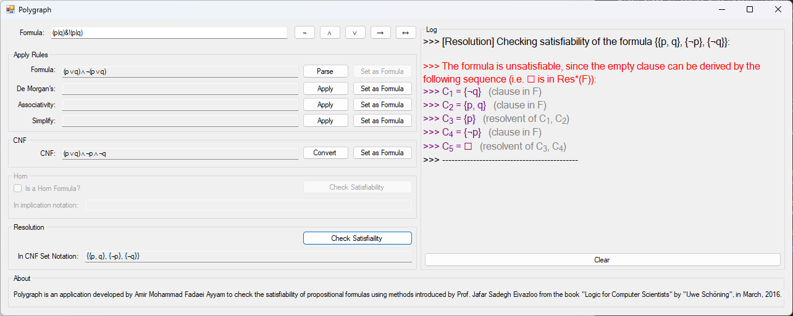

# Polygraph

Polygraph is a desktop application I wrote back in my undergraduate _Logic_ course back in March 2016. It is a simple SAT solver that takes a formula in propositional logic, and checks whether the formula is satisfiable.

An unsatisfiable formula, is a formula that will evaluate to _false_, no matter what values are assigned to its variables.
For example the formula `p∧¬p` is unsatisfiable, regardless of the value of `p`.

## Screenshots

### `p∨q`

### `p∧¬p`

### `(p∨q)∧¬(p∨q)`

## Some Details

The project is in C#, uses `Windows.Forms` (it was the only thing I knew back then) and originally targeted .Net Framework 4.5.2. I can see many problems with the code base. Weird naming conventions, unused `using`s, non-responsive UI, etc. These can easily be fixed, however, I chose not to do so. The point of this repo is to remind me how I used to think and code back in 2016.

I only updated the .Net Framework version to v4.8 because I don't have v4.5.2 currently installed.
